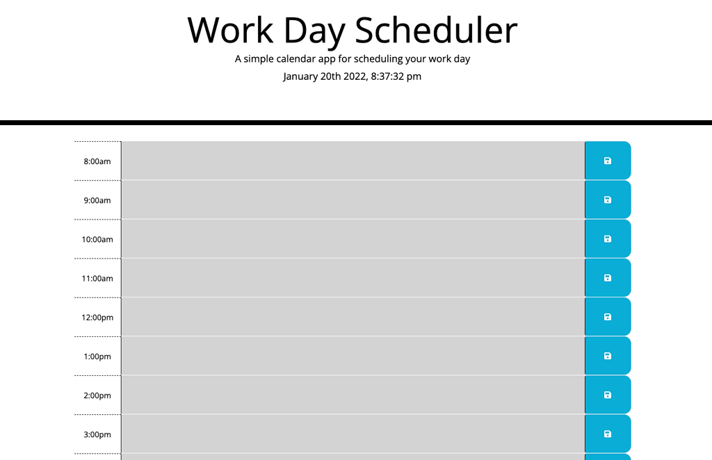

<h1 align="center">Quick Work Day Planner 🚀 </h1>

 
## Description
A work day planner for those that are too busy to just pick up a notebook. Type it out! https://katcontrerasdev.github.io/quickWorkDayPlanner/

## Table of Contents
- [Description](#description)
- [Installation](#installation)
- [Usage](#usage)
- [License](#license)
- [Contributing](#contributing)
- [Tests](#tests)
- [Questions](#questions)
## Installation
Just run the application by going to https://katcontrerasdev.github.io/quickWorkDayPlanner/
## Usage
Lazy workaholics.
## License

 
This application is covered by the MIT license. 
## Contributing
Kat Contreras and the googles.
## Tests
Not right now.
## Questions
Just email kat.contreras@gmail.com 
 
:octocat: Find me on GitHub: [katcontrerasdev](https://github.com/katcontrerasdev) 
 
Email me with any questions: kat.contreras@gmail.com  
  
